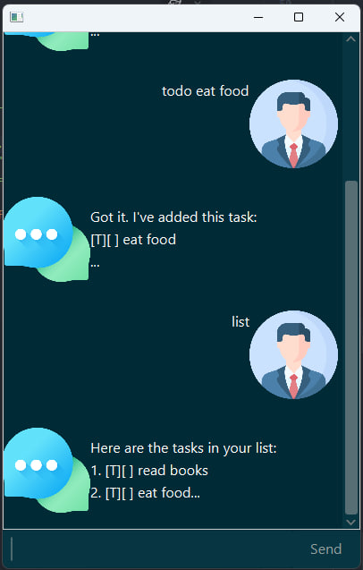

# Ben User Guide



Ben is a simple task manager chatbot you can interact with to add todos, deadlines, events and delete tasks. You can also list, mark , unmark, and find, and filter specific tasks.

This user guide will run through all CLI commands within this Ben chatbot:
- Todo
- Deadline
- Event
- Delete
- Mark
- Unmark
- List
- Find
- Findin
- Exit

## Todo

Adds a Todo task in the task list.

CLI input: `todo [description]`

Example: `todo eat dinner`

Todo is added and the task list is updated with the new Todo task.

```
Got it. I've added this task:
[T][ ] eat dinner

Now you have X tasks in the list.
```

## Deadline

Adds a Deadline task in the task list.

CLI input: `deadline [description] /by [YYYY-MM-DD]`

Example: `deadline eat lunch /by 2024-02-26`

Deadline is added and the task list is updated with the new Deadline task with end date.

```
Got it. I've added this task:
[D][ ] eat lunch (by: Feb 26 2024)

Now you have X tasks in the list.
```


## Event

Adds a Deadline task in the task list.

CLI input: `event [description] /from [YYYY-MM-DD] /to [YYYY-MM-DD]`

Example: `event Arts Showcase /from 2024-02-20 /to 2024-02-21`

Event is added and the task list is updated with the new Event task with start and end dates.

```
Got it. I've added this task:
[E][ ] Arts Showcase (from: Feb 20 2024 to: Feb 21 2024)

Now you have X tasks in the list.
```

## Delete

Deletes an existing task in the task list.

CLI input: `delete [item #]`

Example: `delete 2` (deletes 2nd item in the list)

Item is deleted from the task list, and the other itemes remain in the list. Note that the numbering follows a 1-ordering, where item n denotes the nth item to be deleted in the list. For example, `delete 2` deletes the 2nd item in the list.

```
Noted. I've removed this task.
[T][ ] read books
```

## Mark

Marks an existing task in the task list.

CLI input: `mark [item#]`

Example: `mark 2` (marks 2nd item in the list)

Item is marked in the task list. If an item has already been marked, there will be no change to the marking status.

```
Nice! I've marked this task as done:
[T][X] eat dinner
```

## Unmark

Unmarks an existing task in the task list.

CLI input: `unmark [item#]`

Example: `unmark 2` (marks 2nd item in the list)

Item is unmarked in the task list. If an item has already been unmarked, there will be no change to the marking status.

```
OK, I've marked this task as not done yet:
[T][ ] eat dinner
```

## List

Lists all tasks in the task list.

CLI input / Example: `list`

The entire list is being displayed onto the GUI, and each item is numbered starting from 1.

```
Here are the tasks in your list:
1. [T][ ] eat food
2. [T][ ] eat dinner
3. [D][ ] eat lunch (by: Feb 26 2024)
```

## Find

Finds all tasks that match the keyword searched, and displays the matched tasks onto the GUI.

CLI input: `find [keyword]`

Example: `find eat food`

```
Here are the tasks in your list:
1. [T][ ] eat food
```

Find also allows partial keywords search.

Example: `find d`

```
Here are the tasks in your list:
1. [T][ ] eat food
2. [T][ ] eat dinner
```

Find uses the `.contains([keyword])` to search for specific keyword in the `Task::toString()` method, which allows for partial keyword search.

## Findin

Finds all tasks that match the keyword searched with a specified task type (i.e. Todo, Deadline, Event), and displays the matched tasks onto the GUI.

CLI input: `findin [keyword] /[task type]`

Example: `findin eat /todo`

```
Here are the tasks in your list:
1. [T][ ] eat food
2. [T][ ] eat dinner
```

Example: `findin eat /deadline`

```
Here are the tasks in your list:
1. [D][ ] eat lunch (by: Feb 26 2024)
```

## Exit

Exits the program and stops the Ben chatbot.

CLI input / Example: `bye

```
Bye. Hope to see you again soon!
```